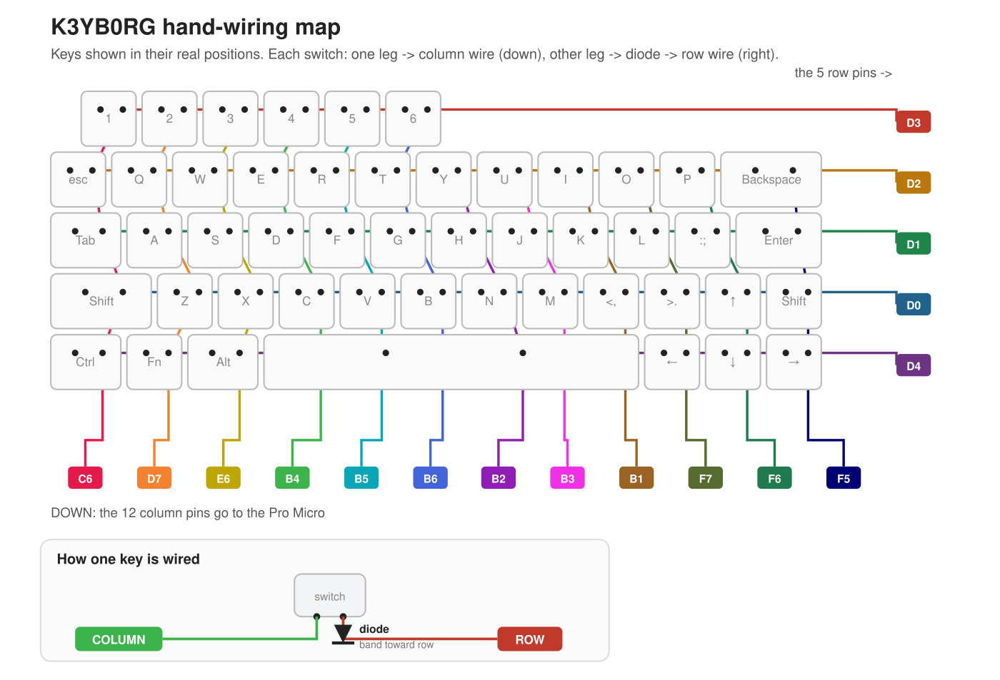

# K3YB0RG

> A 3D-printable, hand-wired mechanical keyboard inspired by the **v4n4g0n** ergo layout.

The K3YB0RG is a compact **49-key** board you print, hand-wire, and flash yourself. It runs
[QMK](https://qmk.fm/) on a Pro Micro (ATmega32U4), so the layout and layers are fully
customizable. This guide walks through every step — printing the case, wiring the switch
matrix, flashing the firmware, and final assembly.

**Build at a glance:** ~49 switches + diodes · a Pro Micro · 4 printed parts · basic soldering.
A good intermediate project — if you can solder a straight joint, you can build this.

## Contents

- [Materials](#materials)
- [3D Printing](#3d-printing)
- [Soldering & Wiring](#soldering)
- [Programming](#programming)
- [Assembly](#assembly)
- [Layers & Customization](#layers)
- [Gallery](#gallery)
- [Build Videos](#video-guide)
- [License](#license)

## Materials

**Parts**
- 1N4148 diodes — one per switch (~49)
- MX-style switches (49)
- Keycaps
- Stabilizers — 6.25u Cherry-style for the space bar
- Microcontroller — a Pro Micro with USB-C (any **ATmega32U4** board works)
- 12× **M3 × 16mm** hex screws + nuts
- 20–28 AWG **solid-core** wire (I burn the insulation off at solder points with the iron)
- USB cable (USB-C to USB-A, in my case)
- Zip ties (to secure the microcontroller)

**Tools**
- 3D printer + PLA filament
- Soldering iron (a basic one is fine — quality doesn't matter much)
- Solder — 60/40 rosin core works best
- Solder sucker

## 3D Printing

1. Download the STL files from the [`stl/`](stl) folder (or the [Releases](../../releases) page).
2. Slice with your preferred settings. I recommend:
   - 0.2mm layer height
   - 90% infill
   - a brim for bed adhesion
   - supports for the bottom parts
3. Print these four parts:
   - `V4N_bot_left.stl` (fits a wide range of microcontrollers)
   - `V4N_bot_right.stl`
   - `V4N_top_left.stl`
   - `V4N_top_right.stl`

## Soldering

### How the wiring works — read this first

The Pro Micro doesn't have one pin per key. The 49 keys are wired as a **grid of 5 rows × 12 columns**, and the controller scans that grid to detect presses — so you only run **5 + 12 = 17** signal wires, not 49.

Every switch has two legs, and you solder **three things** to them:

- **One leg → its COLUMN** — joined by a wire to every other switch in the same vertical column.
- **Other leg → a DIODE → its ROW** — solder a diode to the second leg, then join the diodes along each horizontal row.

The diode prevents *ghosting* (phantom keypresses when several keys are held at once). It only passes current one way, so **every diode must face the same direction** — on this board the **black band points toward the row**. Keep them consistent and the matrix just works.

**Where the wires land on the Pro Micro** (these come straight from `k3yb0rg.json`, so they always match the firmware):

| | Pins (in order) |
|---|---|
| **Rows** 0 → 4 (diode side) | `D3, D2, D1, D0, D4` |
| **Columns** 0 → 11 (other leg) | `C6, D7, E6, B4, B5, B6, B2, B3, B1, F7, F6, F5` |

If a key misreads after flashing, it's almost always one row/column wire on the wrong pin, or a diode soldered in backwards.

### Step 1 — Rows

1. Place all switches into the top case pieces.
2. Install the space-bar stabilizer now (you'll regret having to de-solder later if you don't).
3. Solder a diode to each switch with the **black band facing the row wire** (it points down in the photo below):
   
4. Solder a wire connecting the diodes along each row (this run goes to the microcontroller).

### Step 2 — Columns

1. Cut wire long enough to reach from each switch's other leg to the microcontroller pins.
2. Join each column down its switches as shown:
   - **Tip:** burn the insulation off the wire with the iron at each solder point.
   

### Step 3 — Microcontroller

Solder the 17 row/column wires to the Pro Micro using the pins in the table above (and the diagram). For reference, the kbfirmware view and a Pro Micro pinout:

## Programming

1. Download and install [QMK Toolbox](https://qmk.fm/toolbox/).
2. Download the `k3yb0rg.hex` file from this repo.
3. Connect the microcontroller to your computer.
4. In QMK Toolbox:
   - open the hex file
   - check **Auto-flash**
   - select the right MCU (**ATmega32U4** for a Pro Micro)
   - press the reset button (or short **RST** to **GND**)
   - wait for **"Flash complete!"**
5. Your keyboard should now be functional. Open a [keyboard tester](https://www.keyboardtester.com/) to verify all keys work.
6. To customize the keymap or wiring, use [Keyboard Firmware Builder](https://kbfirmware.com/) → **Upload** → open `k3yb0rg.json`.

## Assembly

1. Place the microcontroller in the bottom-left case piece and secure it with a zip tie.
2. Join the top and bottom case pieces with the **M3 × 16mm** screws and nuts.
3. Pop on the keycaps.
4. Enjoy your new keyboard!

## Layers

Edit the layers in [Keyboard Firmware Builder](https://kbfirmware.com/) or QMK Configurator using `k3yb0rg.json`.

<table>
  <tr>
    <td></td>
    <td></td>
    <td></td>
  </tr>
</table>

## Gallery

<table>
  <tr>
    <td></td>
    <td></td>
    <td></td>
  </tr>
  <tr>
    <td></td>
    <td></td>
    <td></td>
  </tr>
</table>

### The v4n4g0n-inspired design

<table>
  <tr>
    <td></td>
    <td></td>
  </tr>
</table>

## Video Guide

An older video guide I made for a previous keyboard (the process is the same):

**Print timelapse:**

## License

Released under the terms in [LICENSE](LICENSE).

## Thanks

<!-- (existing thanks/credits go here) -->
