# \_\_K3YB0RG\_\_

v4n4g0n inspired, 3d printable keyboard

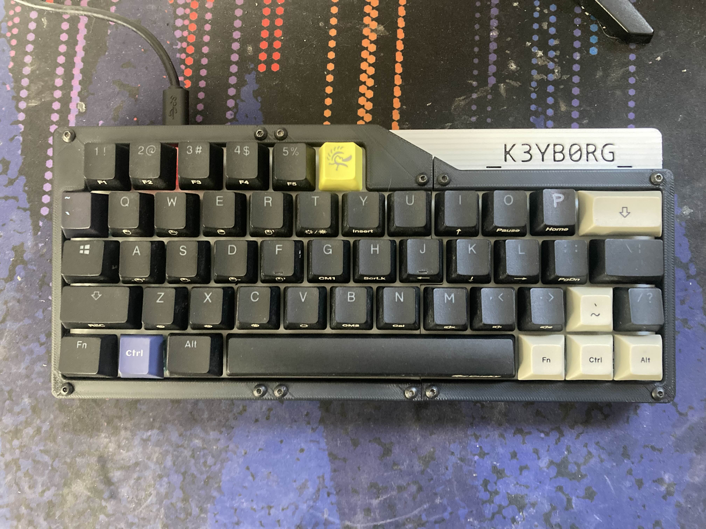
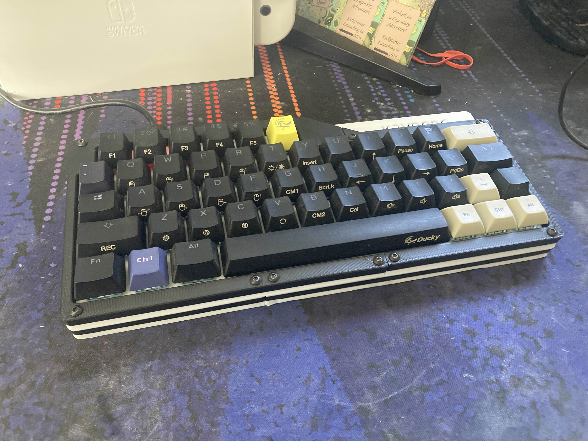
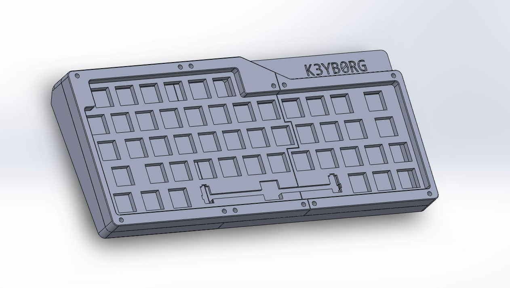
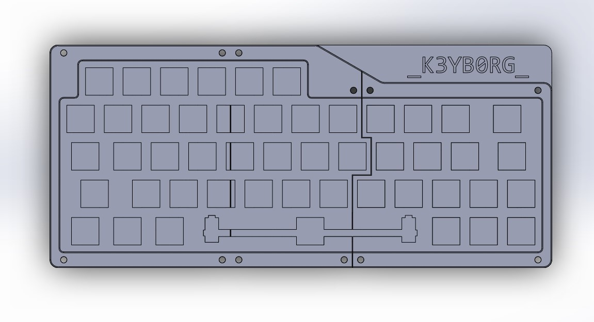
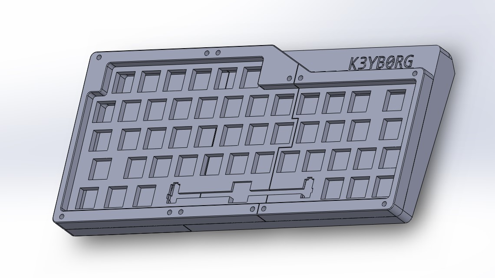
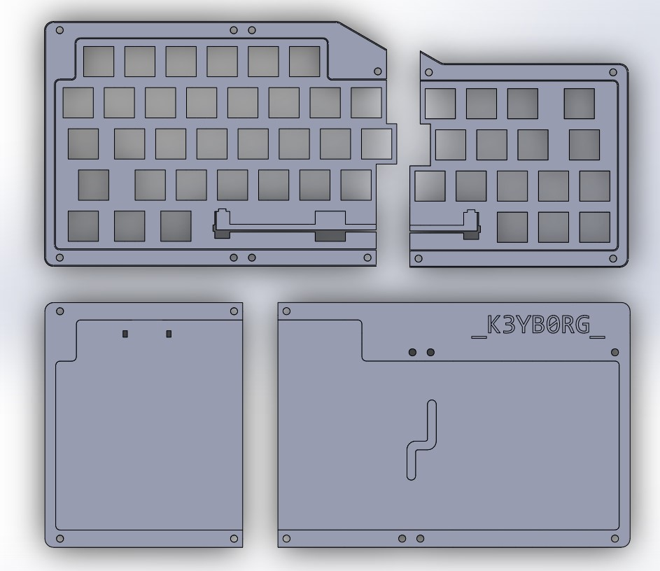
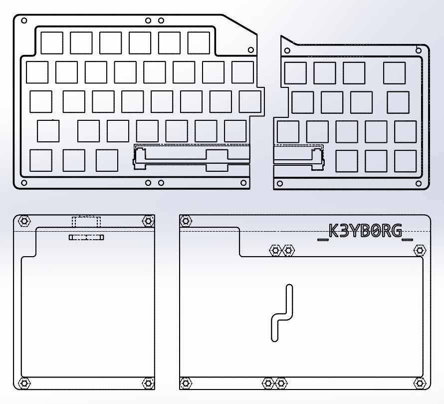

## Materials
1. 3D Printer
2. Filament (PLA)
3. 1N4148 diodes (one for each switch)
4. Switches
5. Keycaps
6. Stabilizers (6.25u Cherry style for space bar)
7. Micro-Controller (I used a Pro Micro with USB C, but others with ATmega32U4 will work)
8. Nuts and Bolts (12 3M x 16mm hex screws and nuts)
9. Wire (I've had the most luck only using 20-28 awg solid core wire. I use the soldering iron to remove insulation.)
10. USB Cable (USB C to USB A in my case)
11. Soldering Iron (A basic soldering iron will do, quality does not matter too much)
12.  Solder (60-40 rosin core solder works best)
13.  Solder Sucker
14.  Zip Ties (for securing micro-controller)

## 3d Print

1. Download the STL files from the releases section.
2. Slice the files using your preferred slicer settings. I recommend using:
   - a layer height of 0.2mm
   - printing at 90% infill 
   - a brim for better bed adhesion
   - supports for bot parts
3. Print the following parts:
    - V4N_bot_left.stl (fits a wide range of micro-controllers)
    - V4N_bot_right.stl
    - V4N_top_left.stl
    - V4N_top_right.stl

## Soldering

### Rows

1. Place all switches into the top case pieces.
2. Put in space key Stabilizer (you'll regret having to de-solder later if you don't do it now)
3. Solder a diode to each switch, making sure the black side of the diode is facing down. *Example image below:*
   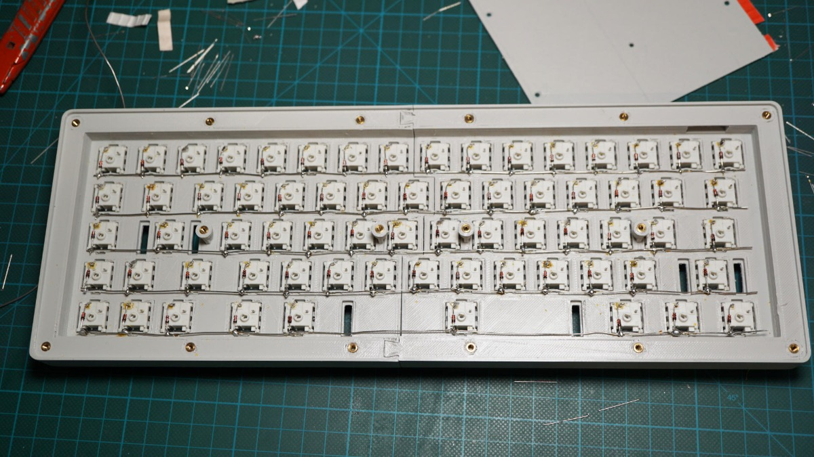
4. Solder a wire at the end of each row of switches (this will go to the micro-controller).

### Columns
1. Cut pieces of wire long enough to reach from the top of the switch to the micro-controller pins.
2. Solder the wires in the following configuration:
    - **Tip:** I like to burn away the insulation on the wire at the points where I want to solder.
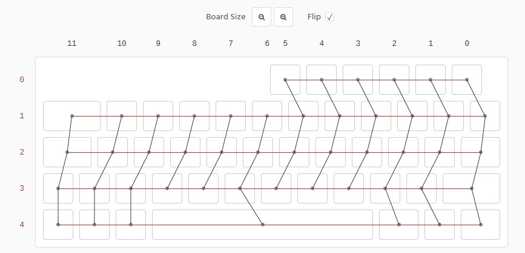

### Micro-controller
1. Solder wires to the micro-controller in the following configuration:
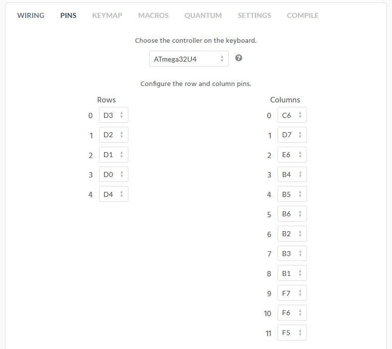
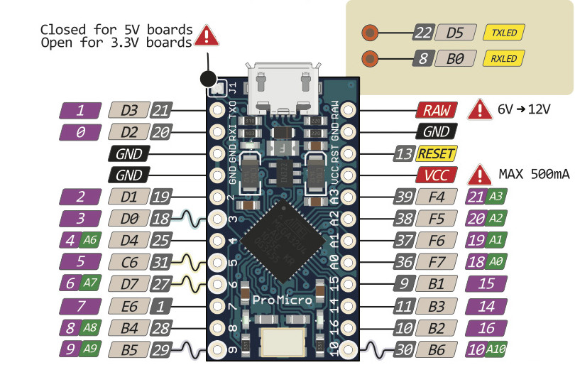

**clarification:**

the top row (ROW 0) should go to D3 on the Pro Micro, the second row (ROW 1) to D2, continue with the rest of the PINS diagram.

## Programming
1. Download and install [QMK Toolbox](https://qmk.fm/toolbox/)
2. Download the hex file k3yb0rg.hex.
3. Connect the micro-controller to your computer.
4. Open QMK Toolbox and flash the k3yb0rg.hex file to the micro-controller.
   - open hex file
   - check "Auto-flash"
   - make sure the correct micro-controller is selected (ATmega32U4 for Pro Micro)
   - press reset button on micro-controller (if available) or short RST to GND
   - wait for "Flash complete!" message
5. Your keyboard should now be functional open keyboard tester to verify all keys work: [Keyboard Tester](https://www.keyboardtester.com/)
6. If you want to customize the keymap or Wiring, you can use [keyboard firmware builder](https://kbfirmware.com/), click upload and open the k3yb0rg.json file.

## Assembly
1. Place the micro-controller into the bottom left case piece and secure it with a zip tie.
2. assemble the top and bottom case pieces together using the 3M x 16mm screws and nuts.
3. Place keycaps on switches.
4. Enjoy your new keyboard!

## V4N4G0N inspired design

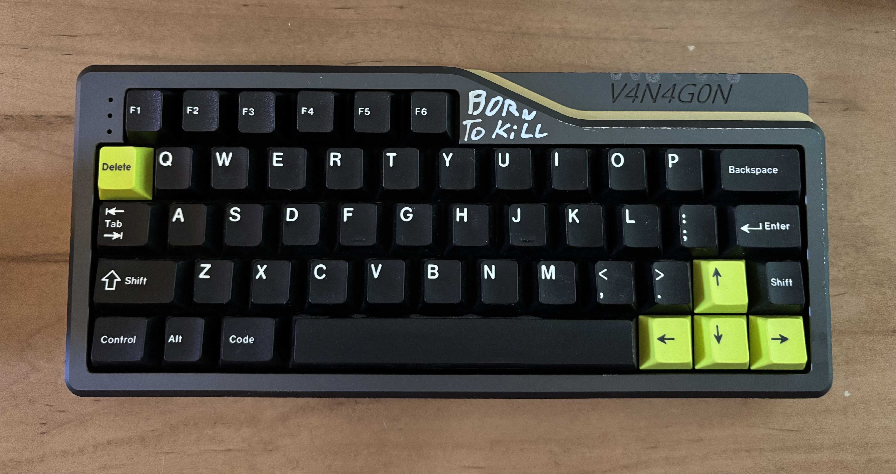

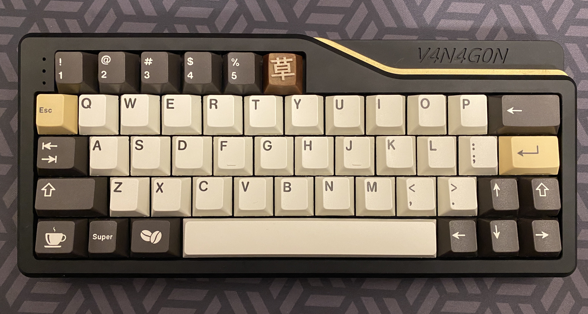

## Layers
you can edit the layers using keyboard firmware builder or QMK Configurator. (Using the k3yb0rg.json file)
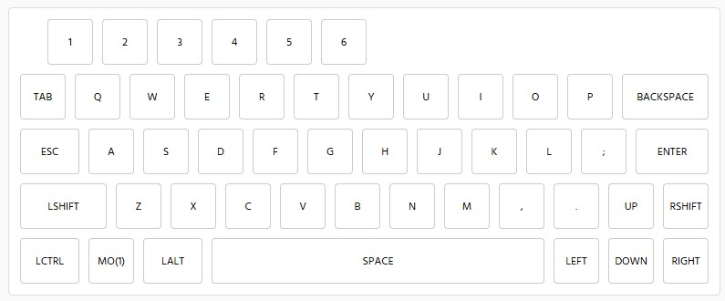
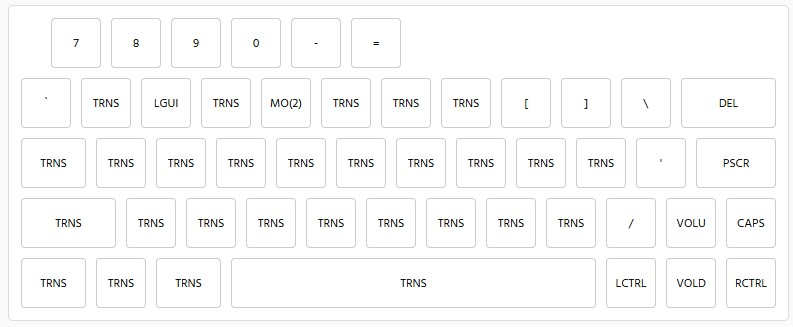
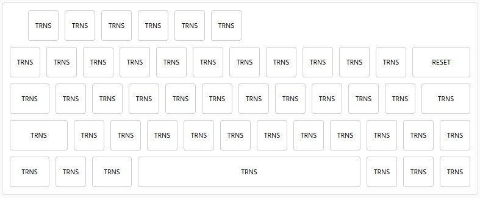

## Video Guide
Here is an old video guide I made for a previous keyboard:

## Thanks for Playing!

